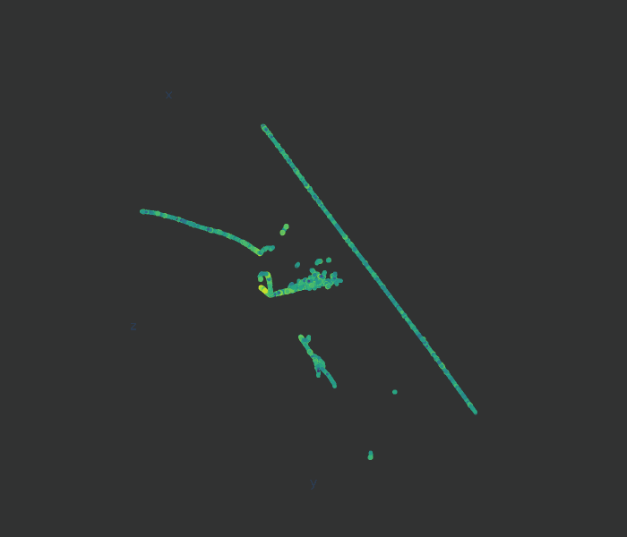
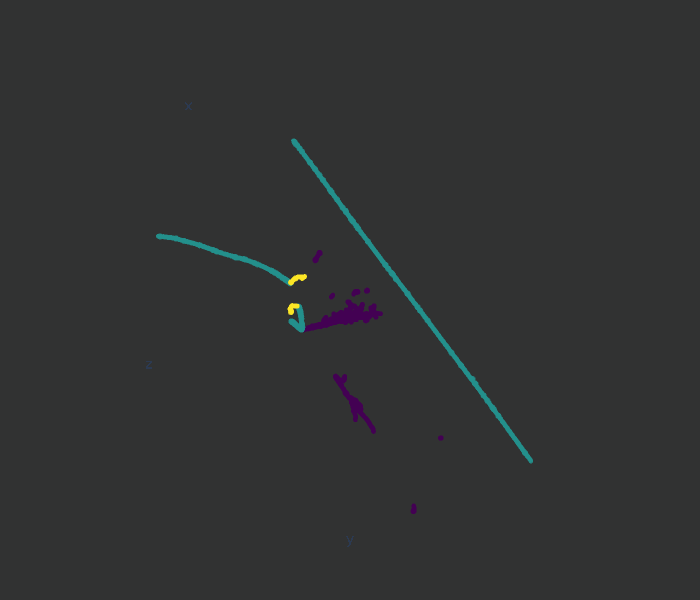

# Project: Find Michels! (INSS 2025)

Welcome to the AI/ML project for INSS 2025. The challenge is simple:

**_Identify the location (i.e. pixels) of a Michel electron in 1 million images of particles._**

## Dataset

You will deal with a 3D image of particle trajectories that look like below.

There are two types of data:

1. "_xyze_" image data (left image above)
    - An array of the shape `(N,4)` for `N` 3D voxels. `float32` type.
    - Each element contains `(x,y,z,energy)` information representing 3D location and amount of energy deposition by a particle.
    - The energy deposition is sampled regularly in space (i.e. "voxelized") in the 768x768x768 space. `(x,y,z)` represent the voxel index along each axis.
    - The deposited energy is in MeV scale.

2. "_label_" data (right image above)
    - An array of the shape `(N)` for `N` 3D voxels (corresponding to "xyze" data). `int32` type.
    - Each element contains a semantic label as an integer value from `0` to `4` for the subject voxel.
      - `0` ... "shower"
      - `1` ... "track"
      - `2` ... **Michel electron**!
      - `3` ... "delta ray"
      - `4` ... scattered energy depositions
     
The _xyze_ and _label_ data are stored in separate files. The filenames should tell you which information is stored.

## Files

There are 4 sets of files.

- A) 1M challenge 
    - `challenge_xyze_1e6.h5` ([link](https://s3df.slac.stanford.edu/data/neutrino/inss/challenge_xyze_1e6.h5), _warning_ 65 GB)
- B) 10k challenge 
    - `challenge_xyze_1e4.h5` ([link](https://s3df.slac.stanford.edu/data/neutrino/inss/challenge_xyze_1e4.h5), _warning_ 681 MB)
- C) 10k training
    - `train_xyze_1e4.h5` ([link](https://s3df.slac.stanford.edu/data/neutrino/inss/train_xyze_1e4.h5), _warning_ 669 MB)
    - `train_label_1e4.h5` ([link](https://s3df.slac.stanford.edu/data/neutrino/inss/train_label_1e4.h5), _warning_ 172 MB)
- D) Example 100 events
    - `example_xyze_100.h5` ([link](https://s3df.slac.stanford.edu/data/neutrino/inss/example_xyze_100.h5), 6.4 MB)
    - `example_label_100.h5` ([link](https://s3df.slac.stanford.edu/data/neutrino/inss/example_label_100.h5), 1.7 MB)
    - `example_solution_100.h5` ([link](https://s3df.slac.stanford.edu/data/neutrino/inss/example_solution_100.h5), 36 KB)

The 100 event files (D) is a subset of 10k training datasets.

To obtain these files:
* You can download from the link above
* You can copy from Kazu's local flash drive while he is at INSS Aug. 12 (Tue) - 15 (Fri).
* If you have S3DF computing account, they can be found under `/sdf/data/neutrino/public_html/inss/`
  * Kazu can help copying files to other sites (NERSC, Aurora, FNAL, etc.)

## Accessing data in files

Take a look at [this example notebook](https://nbviewer.org/github/DeepLearnPhysics/INSS2025/blob/main/notebooks/data_access.ipynb).

## Challenge Task

* By the deadline, identify the location of Michel electron pixels in all images
* **The goal is to analyze 1M images (file A).**
  * **_However_**, if that not possible, you can also submit your solution based on 10k images (file B).
* Submit your solution in single HDF5 file format
  * The file should contain a variable length array of type `int32`, the length of the array should be the number of images.
  * The array elements should indicate the 3D voxel index of Michel electron pixels in the original `N` long array in the `xyze` data.
      * You can find an example solution format store in D) file, `example_solution_100.h5` ([link](https://s3df.slac.stanford.edu/data/neutrino/inss/example_solution_100.h5)). 
  * The solution file should be small and you can upload to [this google dirive folder](https://drive.google.com/drive/folders/1D6KAkd2Fyi6mqk6pYsz1ZZhh7eOWA9lw?usp=sharing).
 
### Bonus Task
* Write a toy MC simulation for Michel electron energy spectrum.
* Generate a simulated energy spectrum with high statistics (so it's smooth!)
* Analyze the 10k training dataset (file C) and draw the energy spectrum of Michel electrons.
* Compare the shape of two spectrums and comment on the diffrences.
* Propose potential source of discrepancies. 

## Performance Criteria

We will evaluate your solution based on the [F1 score](https://en.wikipedia.org/wiki/F-score). 

The results are separated for 1M images (file A) and 10k images (file B). The former demonstrates scalability over the latter, important for ever-growing neutrino detectors!

When you submit your solution, Kazu will try to get back to you as soon as possible. This means you can submit a solution for 10k sample dataset first to see how you perform (if you want to) before submitting a final solution for 1M dataset.

## How you might proceed:

Use 100 example dataset (file D) to get a feeling for the challenge.

Use 10k training dataset (file C) with labels to develop your model and validate its generalizablility.

