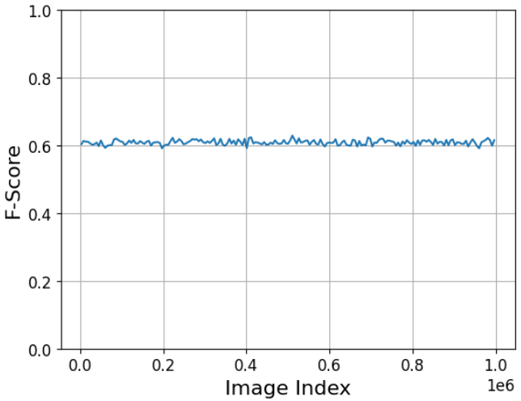
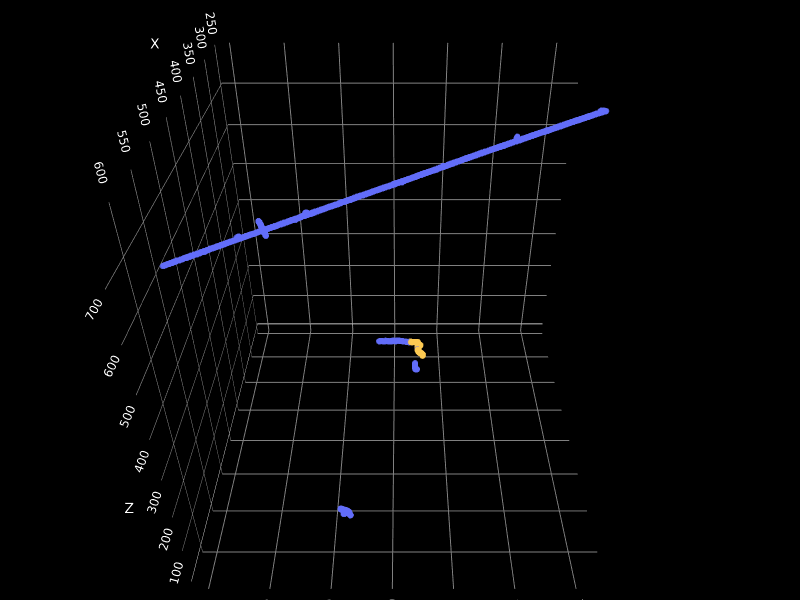
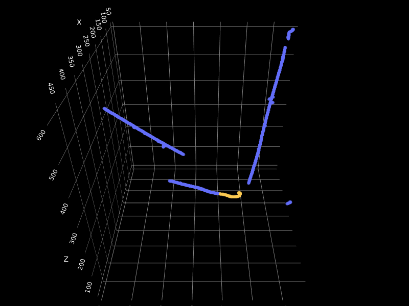
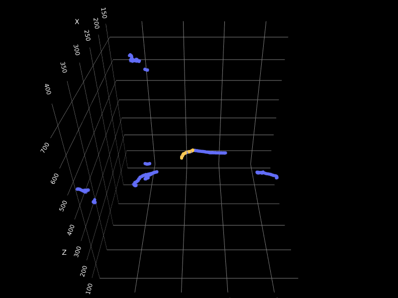
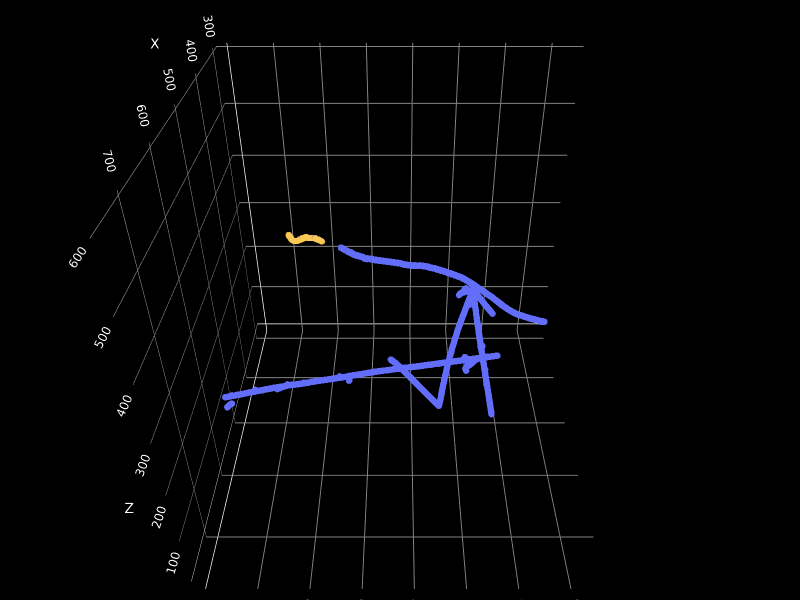

# Group 8

The solution was submitted to the drive [here](https://drive.google.com/drive/folders/1D6KAkd2Fyi6mqk6pYsz1ZZhh7eOWA9lw?usp=sharing)!

Comments:
* Managing to have processed 1M images is really impressive!
* Consistent performance across all images in the file (see below) shows the model robustness.
* Gread F-score. Awesome example event displays (see below).

## F-Score

10k Challenge: **_0.668_**

1M  Challenge: **_0.638_**

## Example (cherry picked) Events

## Well Reconstructed Events

Both precision and recall are above 0.95 in 1M dataset

| Entry | Michel npx. | Precision | Recall |
|---|---|---|---|
| 144889 | 21 | 0.955 | 1.0 |
| 173107 | 34 | 0.971 | 0.971 |
| 191080 | 61 | 0.967 | 0.951 |
| 203792 | 32 | 0.969 | 0.969 |
| 222355 | 85 | 0.976 | 0.953 |
| 225787 | 69 | 0.971 | 0.957 |
| 250471 | 54 | 0.964 | 0.981 |
| 305583 | 24 | 0.958 | 0.958 |
| 333630 | 42 | 0.952 | 0.952 |
| 396126 | 49 | 0.979 | 0.959 |
| 398305 | 47 | 0.957 | 0.957 |
| 512088 | 86 | 0.965 | 0.953 |
| 527730 | 26 | 0.962 | 0.962 |
| 532401 | 64 | 0.953 | 0.953 |
| 547048 | 44 | 0.956 | 0.977 |
| 562298 | 21 | 1.0 | 1.0 |
| 594483 | 67 | 0.97 | 0.955 |
| 635840 | 14 | 1.0 | 1.0 |
| 650116 | 13 | 1.0 | 1.0 |
| 688413 | 30 | 0.967 | 0.967 |
| 718663 | 42 | 0.952 | 0.952 |
| 734301 | 24 | 1.0 | 0.958 |
| 740021 | 11 | 1.0 | 1.0 |
| 947273 | 35 | 0.971 | 0.971 |
| 987241 | 62 | 0.952 | 0.952 |
